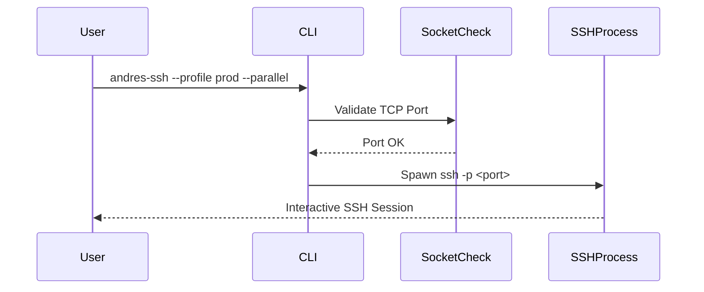

# python-utilities
Python utilities for every day.

# python-utilities

Python utilities for everyday engineering tasks.

---

## Overview

This repository contains a collection of practical Python utilities designed to simplify daily operational workflows. The first featured tool, **`andres-ssh`**, is a multi-port SSH orchestration CLI that enables parallel or sequential SSH connections to a single host across multiple TCP ports.

While it started as a simple script to avoid typing repetitive SSH commands, it quickly evolved into a structured, profile-driven DevOps utility. What began as “just one more quick script” became a small but disciplined CLI tool — as most engineering stories tend to do.

---

# 🔐 andres-ssh

`andres-ssh` is a command-line interface (CLI) tool that allows:

- Multi-port SSH connections
- Parallel or sequential execution
- Profile-based configuration
- SSH private key support
- Port availability validation before connection

---

## ⚠️ Technical Note

Each SSH session corresponds to exactly **one TCP port**.

It is **not possible** to open multiple ports within a single SSH connection.  
For this reason, the tool creates one SSH process per port when executing multiple connections.

Architecture conceptually:

```
Client ── TCP Port X ──> Server
Client ── TCP Port Y ──> Server
Client ── TCP Port Z ──> Server
```

Multiple ports = Multiple independent SSH processes.

---

## Installation

Make the script executable:

```bash
chmod +x andres_ssh.py
```

Move it to your PATH:

```bash
mv andres_ssh.py /usr/local/bin/andres-ssh
```

You can now invoke it globally:

```bash
andres-ssh --profile prod --parallel
```

---

## Usage

### Using a Profile

```bash
andres-ssh --profile prod --parallel
```

### Without Profile

```bash
andres-ssh \
  --user andres \
  --host 10.0.0.10 \
  --ports 1,15 \
  --key ~/.ssh/id_rsa \
  --parallel
```

---

## CLI Options

| Option | Description |
|--------|-------------|
| `--profile` | Load predefined configuration |
| `--parallel` | Execute connections concurrently |
| `--user` | SSH username |
| `--host` | Target host |
| `--ports` | Comma-separated list of ports |
| `--key` | Path to SSH private key |

---

## Profiles Configuration

Create a file named:

```
ssh_profiles.json
```

Example:

```json
{
  "prod": {
    "usuario": "andres",
    "servidor": "10.0.0.15",
    "puertos": [1, 15],
    "key_path": "/Users/andres/.ssh/id_rsa"
  }
}
```

The CLI will automatically load this configuration when using:

```bash
andres-ssh --profile prod
```

---

## Port Validation

Before attempting to establish an SSH session, the tool verifies TCP availability using a socket check.  
Unavailable ports are skipped, preventing unnecessary timeouts.

---

## Execution Model

Internal flow:

```
CLI → argparse → profile loader → port validation →
spawn SSH process per port → wait (if parallel mode)
```

---

## Design Philosophy

This utility follows a simple principle:

> Small tools, well-defined behavior, operational clarity.

It avoids unnecessary abstraction while maintaining:
- Clear separation of concerns
- Deterministic behavior
- Explicit execution model

And yes, it still remembers its humble origins as a “quick script” written to avoid typing the same SSH command three times in a row.

---

## Future Enhancements

Potential next iterations may include:

- tmux integration
- macOS new-tab automation
- Bastion / jump-host support
- Structured logging
- Packaging as a pip-installable tool
- Containerized utility version

---

## License

Internal utility. Adapt and extend according to operational needs.

---

**Maintained by:** Juan Andres Mercado  
Engineering-first mindset. Practical tooling. Continuous refinement.
# python-utilities

[](#release-v100)
[]()
[]()
[]()

Professional-grade Python utilities for everyday engineering workflows.

---

## 📦 Overview

This repository contains practical, production-oriented Python utilities designed to simplify operational and DevOps workflows.

The first official release introduces:

> 🔐 **andres-ssh** — A multi-port SSH orchestration CLI.

What originally began as a small script to avoid typing repetitive SSH commands evolved into a structured, profile-driven, validated CLI utility.  
As is tradition in engineering, “just a quick script” turned into a versioned tool with documentation.

---

# 🔐 andres-ssh

`andres-ssh` is a command-line tool that enables:

- Multi-port SSH connections
- Parallel or sequential execution
- Profile-based configuration
- SSH private key support
- TCP port availability validation
- Deterministic execution model

---

## ⚠️ Technical Clarification

Each SSH session corresponds to exactly **one TCP port**.

It is **not possible** to open multiple ports within a single SSH connection.  
Therefore, the tool spawns one SSH process per port.

Conceptual network model:

```
Client ── TCP Port X ──> Server
Client ── TCP Port Y ──> Server
Client ── TCP Port Z ──> Server
```

Multiple ports = Multiple independent SSH sessions.

---

# 🏗 Architecture

## Execution Flow


---

## Runtime Model



---

# 🚀 Installation

Make executable:

```bash
chmod +x andres_ssh.py
```

Move to PATH:

```bash
mv andres_ssh.py /usr/local/bin/andres-ssh
```

Global usage:

```bash
andres-ssh --profile prod --parallel
```

---

# 🧠 Usage

### Using a Profile

```bash
andres-ssh --profile prod --parallel
```

### Without Profile

```bash
andres-ssh \
  --user andres \
  --host 10.0.0.10 \
  --ports 1,15 \
  --key ~/.ssh/id_rsa \
  --parallel
```

---

# ⚙️ CLI Options

| Option | Description |
|--------|-------------|
| `--profile` | Load predefined configuration |
| `--parallel` | Execute connections concurrently |
| `--user` | SSH username |
| `--host` | Target host |
| `--ports` | Comma-separated list of ports |
| `--key` | Path to SSH private key |

---

# 📁 Profiles Configuration

Create:

```
ssh_profiles.json
```

Example:

```json
{
  "prod": {
    "usuario": "andres",
    "servidor": "10.0.0.15",
    "puertos": [1, 15],
    "key_path": "/Users/andres/.ssh/id_rsa"
  }
}
```

---

# 🔍 Port Validation

Before initiating SSH, the tool performs a TCP socket validation:

- Open port → SSH executed
- Closed port → Skipped
- Prevents unnecessary connection timeouts

---

# 🧩 Repository Structure (Professional Layout Recommendation)

```
python-utilities/
│
├── andres_ssh.py
├── ssh_profiles.json
├── README.md
├── CHANGELOG.md
├── ROADMAP.md
└── LICENSE
```

---

# 🗺 Roadmap

## v1.x (Stability Phase)

- [x] Multi-port SSH
- [x] Parallel execution
- [x] Profile loading
- [x] TCP validation
- [ ] Structured logging
- [ ] Bastion / Jump host support

## v2.0 (Expansion Phase)

- [ ] tmux integration
- [ ] macOS new-tab automation
- [ ] PIP-installable packaging
- [ ] Docker utility image
- [ ] Configuration via environment variables
- [ ] Observability hooks

---

# 📜 Release v1.0.0

## 🎉 Highlights

- First stable release
- Deterministic CLI execution
- Production-ready profile support
- Explicit port-per-process design
- Clean architectural separation

---

# 📝 Changelog

## [1.0.0] – Initial Stable Release

### Added
- argparse-based CLI
- Parallel execution flag
- JSON profile loading
- TCP port availability validation
- SSH private key support
- Graceful interruption handling

### Design Notes
- One process per TCP port
- Explicit execution control
- Minimal abstraction, maximum clarity

---

# 🧠 Design Philosophy

> Small tools. Explicit behavior. Engineering discipline.

This utility intentionally avoids overengineering while preserving:

- Deterministic behavior
- Clear separation of concerns
- Operational transparency
- Minimal external dependencies

And yes — it still remembers its origin as a “quick script” written to avoid typing the same SSH command three times in a row.

---

# 📌 Versioning Strategy

This project follows Semantic Versioning:

```
MAJOR.MINOR.PATCH
```

- MAJOR → Breaking changes
- MINOR → Backward-compatible features
- PATCH → Bug fixes

Current version: **1.0.0**

---

# 📄 License

Internal engineering utility. Extend according to operational needs.

---

**Maintained by:** Juan Andres Mercado  
Engineering-first mindset. Practical tooling. Continuous refinement.